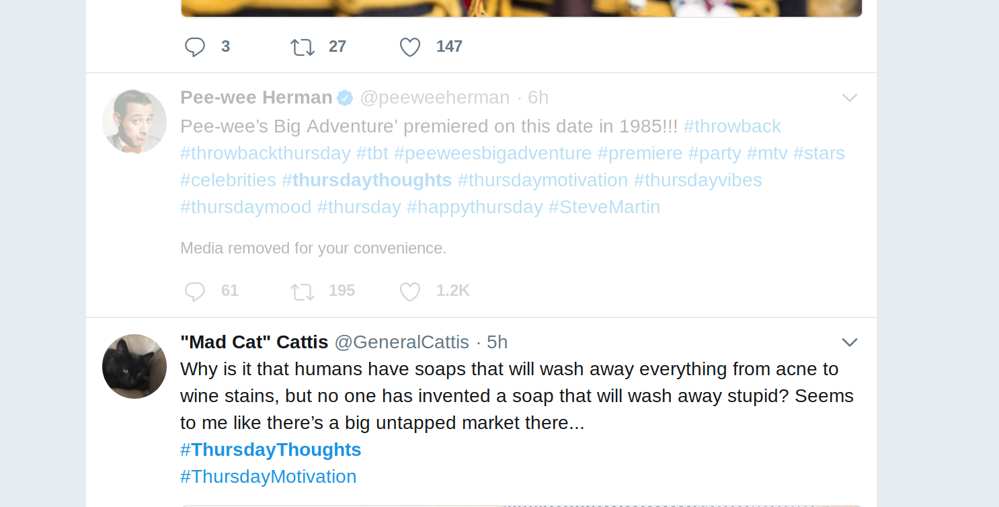

  

  

     Because anything beyond two hashtags is excessive.
     
    <strong>Install StopTwitterSpam on...</strong>
     
    <a href="https://addons.mozilla.org/en-US/firefox/addon/stoptwitterspam/">Firefox</a> or <a href="https://chrome.google.com/webstore/detail/stoptwitterspam/deffhkogioklbgoopnchedbbmfeeoegm">Chrome</a>
  

---

## What is this...

Anything beyond two hashtags is excessive. This is a browser extension that reduces the opacity of all the SEO spam that litters Twitter.

For a complete demo, see [this Tweet](https://twitter.com/MilesMcCain/status/1022576747991195653). Here is an example of StopTwitterSpam in action:

Before StopTwitterSpam, this SEO-optimized Tweet would have taken up your entire screen. But not anymore! Now, you barely even notice it.

## Why?

This project was made largely as a joke, because Dr. Z told me to "#BeTheChange" when I [complained](https://twitter.com/nicholaszufelt/status/1022562456508489728) about Twitter spam.

## License

Icon by Freepik, licensed under CC-BY 3.0. Source licensed under GPLv3.